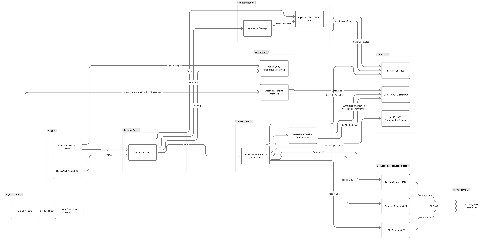
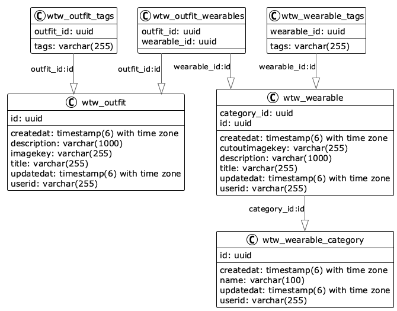
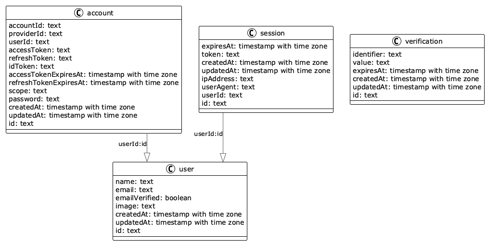

# What to Wear (WTW)

What to Wear is a full-stack wardrobe platform built as a diploma thesis project. It lets users digitize clothing items, organize them by personal categories, and generate outfit recommendations with AI-assisted tooling.

The repository is a monorepo with a mobile app, backend API, Python AI services, deployment infrastructure, and a marketing web app.

## Features

- JWT-authenticated wardrobe management (create, list, update, delete).
- User-owned categories with default category bootstrapping.
- Outfit creation from selected wardrobe items.
- AI tag/category prediction for uploaded clothing images.
- AI-based outfit recommendation flow from uploaded wardrobe images.
- Background removal microservice (`rembg`) for cleaner clothing images.
- Scraper proxy endpoints for Zalando, Pinterest, and H&M product links.
- MinIO-backed image storage with presigned URLs and public image proxy endpoints.
- Production CI/CD via GitHub Actions, GHCR images, Traefik, and Docker Compose.

## Repository Structure

| Path | Purpose |
| --- | --- |
| `frontend/` | Expo React Native app (iOS/Android/Web), Better Auth integration, API clients |
| `backend/` | Quarkus API (`/api/*`), OIDC auth, PostgreSQL + MinIO integration |
| `python/` | FastAPI AI service (Qdrant + embeddings + outfit generation) and indexing utilities |
| `docker/` | Local and production compose stacks, rembg service, scraper services, deployment assets |
| `web/` | Next.js marketing/waitlist website |
| `remotion/` | Video composition project for promo/demo assets |
| `thesis/` | Thesis-related resources/docs |

## Tech Stack

### Mobile Frontend (`frontend/`)

- Expo SDK `54`
- React Native `0.81`
- TypeScript
- Expo Router
- NativeWind + Gluestack UI
- Better Auth + Keycloak OAuth2/OIDC

### Backend API (`backend/`)

- Java `21`
- Quarkus `3.30.4`
- Hibernate ORM Panache
- PostgreSQL `18`
- MinIO (S3-compatible storage)
- OIDC/JWT auth

### AI and Supporting Services

- Python `3.11` FastAPI service (`python/core`)
- Qdrant vector DB
- CLIP embeddings + outfit generation utilities
- `rembg` microservice for background removal
- Scraper microservices for H&M, Pinterest, Zalando

### Deployment and Operations

- Docker Compose (local + production)
- Traefik routing in production
- GitHub Actions for build, publish, deploy, and Qdrant reindex workflows
- GHCR container registry

## Architecture Overview

### System Architecture



[View in Figma](https://www.figma.com/board/sPkqpNIpALgsEIQywzRllJ/WTW---System-Architecture?node-id=0-1)

**Data flow:**

- Clients (Expo mobile app, Next.js web app) connect through **Traefik** reverse proxy via HTTPS.
- Traefik routes requests by path: `/api` to backend, `/auth` to Keycloak, `/rembg` to background removal, scrapers to their respective services.
- **Quarkus backend** handles business logic, persists metadata in **PostgreSQL**, stores images in **MinIO**, delegates AI tasks to the **Python FastAPI service**, and proxies scraper requests.
- **Python AI service** generates CLIP embeddings and performs outfit recommendations via **Qdrant** vector search.
- **Scraper microservices** (H&M, Pinterest, Zalando) route outbound requests through a **Tor forward proxy** for IP rotation.
- **rembg** provides standalone background removal, called directly from the frontend.
- **Embedding Indexer** is a batch job that indexes the preprocessed dataset into Qdrant (runs on-demand via Docker profile).
- **GitHub Actions** builds and pushes container images to **GHCR** for production deployment.

Additional notes:

- `frontend` can call `rembg` directly for background removal (`/remove-bg`).
- Backend image responses include presigned MinIO URLs (10-minute expiry).
- Backend also exposes public proxy image endpoints under `/api/image/*`.

### Database Schema

#### Core Domain (Wearables, Outfits, Categories)



#### Better-Auth (User, Account, Session)



## Core Data Model

### Wearable

- `id` (UUID)
- `userId` (from JWT `sub`)
- `category` (`WearableCategory` FK)
- `title`, `description`
- `tags[]`
- `cutoutImageKey` (MinIO object key)
- `createdAt`, `updatedAt`

### WearableCategory

- `id` (UUID)
- `userId`
- `name` (unique per user)
- `createdAt`, `updatedAt`

### Outfit

- `id` (UUID)
- `userId`
- `title`, `description`
- `tags[]`
- `imageKey` (MinIO object key)
- many-to-many relation to `Wearable`
- `createdAt`, `updatedAt`

## API Summary (Backend)

Base URL: `http://localhost:8080/api`

All endpoints are authenticated by default except image proxy paths.

### Wearables

| Method | Path | Notes |
| --- | --- | --- |
| `POST` | `/wearable` | Multipart create (`categoryId`, `title`, `description`, `tags`, `file`) |
| `GET` | `/wearable` | List current user's wearables |
| `GET` | `/wearable/{id}` | Get single wearable |
| `PUT` | `/wearable/{id}` | Update wearable metadata |
| `DELETE` | `/wearable/{id}` | Delete wearable |
| `GET` | `/wearable/by-category?categoryId=<uuid>` | Filter by category |
| `GET` | `/wearable/category` | List category names |
| `POST` | `/wearable/predict` | Multipart image prediction (`file`) |

### Categories

| Method | Path |
| --- | --- |
| `POST` | `/wearable-category` |
| `GET` | `/wearable-category` |
| `GET` | `/wearable-category/{id}` |
| `PUT` | `/wearable-category/{id}` |
| `DELETE` | `/wearable-category/{id}` |

### Outfits

| Method | Path | Notes |
| --- | --- | --- |
| `POST` | `/outfit` | Multipart create (`title`, `description`, `tags`, `wearableIds`, optional `file`) |
| `GET` | `/outfit` | List outfits |
| `GET` | `/outfit/{id}` | Get outfit |
| `PUT` | `/outfit/{id}` | Update title/description/tags/wearableIds |
| `DELETE` | `/outfit/{id}` | Delete outfit |
| `POST` | `/outfit/recommend-from-uploads` | Multipart recommendation input |

### AI and Scraper Proxies

| Method | Path Prefix | Purpose |
| --- | --- | --- |
| `*` | `/wearableai/*` | Proxy to Python AI service |
| `POST` | `/wearableai/scraper/hm` | H&M link scraping |
| `POST` | `/wearableai/scraper/pinterest` | Pinterest link scraping |
| `POST` | `/wearableai/scraper/zalando` | Zalando link scraping |

### Image Proxy (public)

| Method | Path |
| --- | --- |
| `GET` | `/image/wearables/{objectKey}` |
| `GET` | `/image/outfits/{objectKey}` |

## Local Development

### 1. Prerequisites

- Docker + Docker Compose
- Node.js `20+` and npm
- Java `21`
- Python `3.11` (only if running Python service outside Docker)

### 2. Environment Variables

### Frontend (`frontend/.env`)

Important keys:

- `EXPO_PUBLIC_BACKEND_ROOT` (default local: `http://localhost:8080`)
- `EXPO_PUBLIC_BETTER_AUTH_URL`
- `EXPO_PUBLIC_KC_CLIENT_ID`
- `EXPO_PUBLIC_KC_ISSUER`
- `EXPO_PUBLIC_KC_LOGOUT_URL`
- `EXPO_PUBLIC_REMBG_URL` (default local: `http://localhost:8083`)
- `DATABASE_URL` (Better Auth DB connection)
- `BETTER_AUTH_SECRET`

### Backend

Backend reads `backend/src/main/resources/application.properties` defaults plus env overrides:

- `OIDC_AUTH_SERVER_URL`
- `OIDC_CLIENT_ID`
- `MINIO_ACCESS_KEY`
- `MINIO_SECRET_KEY`
- `APP_MINIO_PUBLIC_BASE_URL`
- `APP_PYTHON_BASE_URL`
- `APP_PYTHON_PREDICT_URL`

### Production

- Production compose uses `docker/.env.prod`.
- Do not commit real secrets for production/staging.

### 3. Start Services

### Option A: Full Docker Stack

```bash
cd docker
docker compose up -d
```

This starts DB, Keycloak, MinIO, rembg, Python services, scrapers, backend, and related services.

### Option B: Hybrid (common for active development)

Run infra in Docker, backend/frontend on host:

```bash
cd docker
docker compose up -d wtw-db wtw-keycloak wtw-minio wtw-rembg wtw-qdrant wtw-python wtw-hm-scraper wtw-pinterest-scraper wtw-zalando-scraper
```

Then start app services from host:

```bash
cd backend
./mvnw quarkus:dev
```

```bash
cd frontend
npm install
npm start
```

## Development Commands

### Frontend (`frontend/`)

```bash
npm start
npm run ios
npm run android
npm run web
npm run lint
npm test
```

### Backend (`backend/`)

```bash
./mvnw quarkus:dev
./mvnw test
./mvnw verify
./mvnw package
./mvnw package -Dnative
```

### Python AI (`python/`)

```bash
# service run (host mode)
uvicorn core.app:app --host 0.0.0.0 --port 8000

# tests
pytest core/tests -q
```

### Marketing Web (`web/`)

```bash
npm install
npm run dev
npm run build
npm run start
```

## Ports (Local)

| Service | Port |
| --- | --- |
| Backend | `8080` |
| Keycloak | `8082` |
| MinIO API | `9000` |
| MinIO Console | `9001` |
| rembg | `8083` |
| Python AI | `8084` (mapped to container `8000`) |
| H&M Scraper | `4523` |
| Pinterest Scraper | `4524` |
| Zalando Scraper | `4525` |
| Qdrant | `6333` / `6334` |

## Recommendation Flow Notes

- `POST /api/outfit/recommend-from-uploads` requires at least 5 items.
- Backend validates each request item against authenticated user ownership.
- At least one `TOP`, one `BOTTOM`, and one `FOOTWEAR` category are required.
- If a valid combination is impossible, backend returns HTTP `422` with:
  - `code: OUTFIT_COMBINATION_NOT_POSSIBLE`
  - `missingBuckets`
  - `bucketCounts`

## Authentication Notes

- Backend extracts user ID from JWT `sub` claim.
- Frontend gets Keycloak access token via Better Auth:
  - `frontend/lib/keycloak.ts`
  - `frontend/app/api/auth/[...route]+api.ts`
- API calls include `Authorization: Bearer <token>`.

## Storage Notes

- Wearable bucket default: `wearables`
- Outfit bucket default: `outfits`
- Object key format: `{userId}/{entityId}/{fileName}`
- Presigned URL expiry: `600` seconds

## Deployment (Production)

Production assets:

- Compose file: `docker/docker-compose.prod.yml`
- Env file: `docker/.env.prod`
- Workflows:
  - `.github/workflows/deploy-prod.yml`
  - `.github/workflows/reindex-qdrant-prod.yml`

### `deploy-prod.yml` workflow summary

- Trigger: push to `main` or manual dispatch.
- Detects changed modules with path filters.
- Builds/pushes images to GHCR for changed services.
- Copies compose and Keycloak assets to server.
- Deploys with `docker compose ... up -d --remove-orphans`.
- Runs smoke checks for `python-service`, `wtw-frontend-auth`, `wtw-web`, then backend readiness.

### Production routing (Traefik)

Main host: `what-to-wear.cms-building.at`

- `/api` -> backend
- `/auth` -> Keycloak
- `/rembg` -> rembg service
- `/minio` -> MinIO
- `/api/auth` -> frontend Better Auth service
- root host -> web app

## Testing Status and Gaps

Current test suites exist in:

- `backend/src/test/java`
- `frontend/__tests__`
- `python/core/tests`

Coverage is present but not exhaustive across all API behavior. Before production-critical changes, run at least backend tests, frontend tests/lint, and Python tests.

## Troubleshooting

- `UnknownHostException: wtw-db`:
  - Service is not attached to the expected Docker network.
- Backend works but image URLs fail on devices:
  - Verify `APP_MINIO_PUBLIC_BASE_URL` and frontend URL resolution.
- Outfit recommendations fail with category errors:
  - Ensure wardrobe contains at least one top, bottom, and footwear item.
- Python service health stays `starting`:
  - Cold starts can take longer while embedding model loads.
- Scraper requests rejected:
  - Backend validates vendor domain; use supported hostnames only.

## Additional Modules

- `remotion/wtw-video`: Remotion video composition project.
- `thesis/`: Thesis artifacts and supporting material.

## License

No explicit license file is currently defined in the repository.
